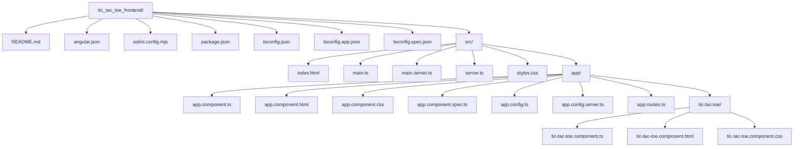

# File Structure Overview: tic_tac_toe_frontend

This document provides an organized overview of the file and folder structure for the `tic_tac_toe_frontend` container of the responsive-tic-tac-toe-4887 project. The project is an Angular web application for playing a two-player game of Tic Tac Toe, featuring a responsive UI, server-side rendering, and a modern minimalistic design.

---

## Folder Hierarchy

```
tic_tac_toe_frontend/
│
├── README.md
├── angular.json
├── eslint.config.mjs
├── package.json
├── tsconfig.json
├── tsconfig.app.json
├── tsconfig.spec.json
├── src/
│   ├── index.html
│   ├── main.ts
│   ├── main.server.ts
│   ├── server.ts
│   ├── styles.css
│   └── app/
│       ├── app.component.ts
│       ├── app.component.html
│       ├── app.component.css
│       ├── app.component.spec.ts
│       ├── app.config.ts
│       ├── app.config.server.ts
│       ├── app.routes.ts
│       └── tic-tac-toe/
│           ├── tic-tac-toe.component.ts
│           ├── tic-tac-toe.component.html
│           └── tic-tac-toe.component.css
```

---

## Top-Level Files and Purpose

- **README.md**: Provides basic project usage and Angular CLI instructions.
- **angular.json**: Angular CLI project configuration. Describes build, serve, test, and file location settings.
- **eslint.config.mjs**: Code linting rules and configuration for TypeScript/JavaScript.
- **package.json**: Node dependencies, scripts for building, testing, and running the app.
- **tsconfig.json**: Base TypeScript configuration for the project.
- **tsconfig.app.json**: App-specific extension of the TypeScript config, registering entry points and outputs for main app builds.
- **tsconfig.spec.json**: Extends base tsconfig with settings for running unit tests.

---

## `src/` Directory

The `src/` folder contains all application source files, including HTML, entry points for browser and server builds, global stylesheet, and the main `app/` feature code.

### Files in `src/`:

- **index.html**: Main HTML file; loads the Angular root `<app-root>` component.
- **main.ts**: Entry point for starting the application in the browser. Bootstraps Angular using `appConfig` and `AppComponent`.
- **main.server.ts**: Entry point for server-side (SSR) rendering in a Node.js environment.
- **server.ts**: Express.js server. Hosts SSR, serves static Angular builds, and responds with server-rendered HTML or handles API endpoints if added.
- **styles.css**: Global stylesheet. Declares resets, base typography, and universal styles for a minimalistic, clean look.

---

## `src/app/` Directory

Holds the application's main code: root Angular components, configuration, and routing.

- **app.component.ts**: The root application component. Loads `<app-tic-tac-toe>`.
- **app.component.html**: Template for the root component (just renders the Tic Tac Toe game).
- **app.component.css**: (Mostly empty) additional stylesheet for the root component.
- **app.component.spec.ts**: Unit test suite for the root component.
- **app.config.ts**: Application configuration for browser, including router and hydration.
- **app.config.server.ts**: Merges browser config with server-specific settings for SSR.
- **app.routes.ts**: Routing definitions (currently empty, as there are no routes in this simple app).

#### `src/app/tic-tac-toe/` Directory

Contains the self-contained component for the Tic Tac Toe game, encapsulating all gameplay logic, template and style:

- **tic-tac-toe.component.ts**: Main Angular component for the game UI/logic. Handles state, player turns, win/draw detection, and board interactivity.
- **tic-tac-toe.component.html**: Angular template for the game UI. Builds a 3x3 grid, game status, and control buttons, using responsive and accessible ARIA practices.
- **tic-tac-toe.component.css**: Component-level styles for the game: board, cells, highlight for winners, status display, and responsive behavior.

---

## Notable Structural Patterns

- **Stand-alone Components**: Both `AppComponent` and `TicTacToeComponent` are `standalone: true`, following new Angular best practices for simpler, modular code.
- **Separation of Concerns**: UI logic, template HTML, and CSS are grouped by feature/component, improving maintainability.
- **Configuration as Code**: Multiple tsconfig files and Angular CLI JSON for environment-specific and build-target settings.
- **Testing**: Basic unit tests for the root app component (in `app.component.spec.ts`).

---

## Folder Structure Diagram (Mermaid)



---

## Summary

The file structure is typical for a modern Angular application, with feature encapsulation (Tic Tac Toe game), best-practice configuration, and clear separation by role: configuration, global assets, entry points, and feature code. The organization promotes maintainability, clarity, and scalability for future enhancements.

---

**Sources Consulted:**  
- angular.json  
- package.json  
- tsconfig.json, tsconfig.app.json, tsconfig.spec.json  
- README.md  
- eslint.config.mjs  
- src/index.html  
- src/styles.css  
- src/main.ts  
- src/main.server.ts  
- src/server.ts  
- src/app/app.component.{ts,html,css,spec.ts}  
- src/app/app.config.{ts,server.ts}  
- src/app/app.routes.ts  
- src/app/tic-tac-toe/*

```
Sources:
responsive-tic-tac-toe-4887/tic_tac_toe_frontend/angular.json
responsive-tic-tac-toe-4887/tic_tac_toe_frontend/package.json
responsive-tic-tac-toe-4887/tic_tac_toe_frontend/tsconfig.json
responsive-tic-tac-toe-4887/tic_tac_toe_frontend/tsconfig.app.json
responsive-tic-tac-toe-4887/tic_tac_toe_frontend/tsconfig.spec.json
responsive-tic-tac-toe-4887/tic_tac_toe_frontend/README.md
responsive-tic-tac-toe-4887/tic_tac_toe_frontend/eslint.config.mjs
responsive-tic-tac-toe-4887/tic_tac_toe_frontend/src/index.html
responsive-tic-tac-toe-4887/tic_tac_toe_frontend/src/styles.css
responsive-tic-tac-toe-4887/tic_tac_toe_frontend/src/main.ts
responsive-tic-tac-toe-4887/tic_tac_toe_frontend/src/main.server.ts
responsive-tic-tac-toe-4887/tic_tac_toe_frontend/src/server.ts
responsive-tic-tac-toe-4887/tic_tac_toe_frontend/src/app/app.component.ts
responsive-tic-tac-toe-4887/tic_tac_toe_frontend/src/app/app.component.html
responsive-tic-tac-toe-4887/tic_tac_toe_frontend/src/app/app.component.css
responsive-tic-tac-toe-4887/tic_tac_toe_frontend/src/app/app.component.spec.ts
responsive-tic-tac-toe-4887/tic_tac_toe_frontend/src/app/app.config.ts
responsive-tic-tac-toe-4887/tic_tac_toe_frontend/src/app/app.config.server.ts
responsive-tic-tac-toe-4887/tic_tac_toe_frontend/src/app/app.routes.ts
responsive-tic-tac-toe-4887/tic_tac_toe_frontend/src/app/tic-tac-toe/tic-tac-toe.component.ts
responsive-tic-tac-toe-4887/tic_tac_toe_frontend/src/app/tic-tac-toe/tic-tac-toe.component.html
responsive-tic-tac-toe-4887/tic_tac_toe_frontend/src/app/tic-tac-toe/tic-tac-toe.component.css
```
